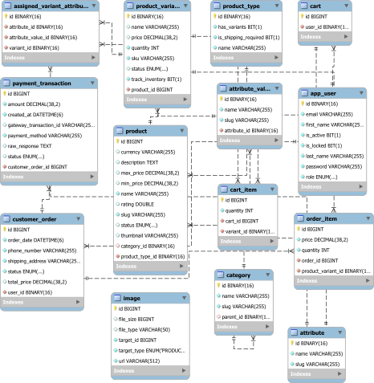

# E-COMMERCE WITH SPRING BOOT

## Project structure

```
E-COMMERCE/
├── backend/          # Spring boot REST API backend
│   ├── src/
│   ├── Dockerfile
│   └── pom.xml
│   
├── redsis/   
│   └── Dockerfile
│   
├── mysql/           
│   └── Dockerfile
│   
├── docker-compose.yaml
├── .env.example
└── README.md
```

## ERD



## Prerequisites

Before running this project, make sure you have the following installed:

* Docker and Docker Compose (for database and services)
* Git (for version control)

## Getting Started

### 1. Clone the Repository

```bash
$ git clone https://github.com/ye-wen-zi/spring-boot-api.git
$ cd spring-boot-api
```

### 2. Environment Setup

Create a .env file (or duplicate .env.example file) in the project root with the following variables:

```bash
# --- DATABASE CONFIG ---
MYSQL_ROOT_PASSWORD=
MYSQL_DATABASE=
MYSQL_USER=
MYSQL_PASSWORD=
MYSQL_PORT=3306

# --- REDIS CONFIG ---
REDIS_PORT=6379

# --- SPRING BOOT CONFIG ---
SPRING_LOCAL_PORT=8080

SPRING_DOC_ENABLE_API_DOC=true
SPRING_DOC_ENABLE_SWAGGER_UI=true

SPRING_SECURITY_SECURE_COOKIE=false
SPRING_SECURITY_JWT_SECRET=
SPRING_SECURITY_ACCESS_TOKEN_EXPIRATION=900000
SPRING_SECURITY_REFRESH_TOKEN_EXPIRATION=86400000
SPRING_SECURITY_HASH_IDS_SALT= # example: asdfhjklcvbnmertyuiopfghjkcvbnmdHJjgj

SPRING_DATASOURCE_DRIVER_CLASS_NAME=com.mysql.cj.jdbc.Driver

SPRING_JPA_HIBERNATE_DDL_AUTO=update
SPRING_JPA_DATABASE=mysql
```

### 3. Start Services

```bash
$ docker compose up -d
```

This will start:
* MySQL on port 3306
* Redis on port 6379
* API service on port 8080 (accessible at [http://localhost:8080](http://localhost:8080))

* Swagger on [http://localhost:8080/docs](http://localhost:8080/docs)

### 4. APIs

* Below are a few important API endpoints. **You can view the full details at [http://localhost:8080/docs](http://localhost:8080/docs)**
* Admin account: email `admin@example.com`, password: `A0123456789$`
* User account: email `user@example.com`, password: `A0123456789$`

#### Generation

Preparing data for API testing can be time-consuming, especially for complex APIs such as those for creating or updating products. Here, I provide an API that generates data using Data Faker.

| Method | Endpoint | Description | Auth Required |
| :--- | :--- | :--- | :--- |
| `GET` | `/api/v1/generation/user` | Generate signup data | No |
| `GET` | `/api/v1/generation/product-update` | Generate new product | No |
| `GET` | `/api/v1/generation/product-create` | Generate new data for existing product | No |

#### Authentication & Users

| Method | Endpoint | Description | Auth Required |
| :--- | :--- | :--- | :--- |
| `POST` | `/api/v1/auth/sign-up` | Register new account | No |
| `POST` | `/api/v1/auth/login` | Login and get JWT Token | No |
| `POST` | `/api/v1/auth/refresh` | Refresh tokens | Yes |
| `GET` | `/api/v1/auth/logout` | Logout | Yes |

#### Products

| Method | Endpoint | Description | Auth Required |
| :--- | :--- | :--- | :--- |
| `GET` | `/api/v1/products` | Get products | No |
| `GET` | `/api/v1/products/{id}` | Get product by id | No |
| `POST` | `/api/v1/products` | Create new product | `ADMIN ROLE` |
| `PUT` | `/api/v1/products/{id}` | Update product | `ADMIN ROLE` |
| `DELETE` | `/api/v1/products/{id}` | Delete product by id | `ADMIN ROLE` |

#### Cart

| Method | Endpoint | Description | Auth Required |
| :--- | :--- | :--- | :--- |
| `GET` | `/api/v1/cart/items` | Get cart | Yes |
| `POST` | `/api/v1/cart/items` | Add, increase, decrease item | Yes |
| `DELETE` | `/api/v1/cart/items` | Remove item from cart | Yes |

😪 **You can view the full details at [http://localhost:8080/docs](http://localhost:8080/docs)**

## Troubleshooting
* On the very first run, the MySQL container requires extra time (around 30–60 seconds) to initialize its database files and setup configurations. If the backend fails to connect initially due to healthcheck timeouts, please increase the `start_period` or `retries` values under the `mysql-service` healthcheck section in your `docker-compose.yml`. 
```docker
healthcheck:
      ...
      interval: 5s
      timeout: 5s
      retries: 10
      start_period: 45s
```

* Alternatively, you can simply wait about 1 minute for the MySQL initialization to complete, then restart the API service using:

```bash
$ docker compose restart spring-service
```

